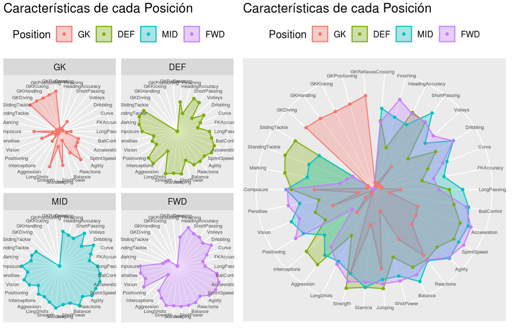

## FIFA

```{r global, include=FALSE}
library(tidyverse)
library(tidymodels)
library(ggplot2)
```

## Introducción

En este laboratorio resolverás un problema distinto basado en un dataset describiendo 18207 jugadores que provee el juego de video FIFA, que utilizarás para asistir en la toma de decisiones de un club de futbol para la compra de jugadores.
El mismo sigue los lineamientos y las mismas técnicas y algoritmos aprendidos en el tutorial L1-A.

# Motivación

Imaginaremos que nuestro interesado o stakeolder es un club de futbol que desea automatizar la tarea de uno de sus expertos que tras costosos análisis produce valiosa información sobre jugadores, necesaria para decidir cuál de ellos adquirir para formar parte de su plantel en cierta determinada posicion.
Específicamente, basandose en información objetiva sobre el jugador (diversas estadísticas), este experto produce un **puntaje del jugador y su potencial valor de mercado**.
Vamos a asumir en este trabajo que producir las estadísticas de los jugadores es económico, sea por innovaciones en sensores o tecnología de visión artificial, o porque simplemente son datos técnicos y objetivos facilmente producibles por terceros no expertos.
Ante esta realidad, se torna valioso utilizarlos para producir un modelo del experto que produzca de forma automática la valiosa información de puntaje y valor de mercado de un número grande de jugadores, pudiendo así analilzar la compra de un número muy superior de jugadores cuando se lo compara con la productividad del experto y sus costosos análisis.

En este laboratorio asumiremos que la información en el dataset provisto por el juego FIFA es real.
Es decir, que por un lado, tanto las estadísticas de los jugadores como el valor de mercado que indica el dataset son certeros y veraces, y por otro, que el puntaje provisto (en la variable **overall_score) ha sido producida por el experto de nuestro club** (o uno de calidad equivalente).

Concretamente, el dataset esta compuesto de datos de 18207 jugadores de FIFA y por cada jugador existen 89 características o features que se describen a continuación, inclulyendo su valor de mercado y su puntaje (overall_score).

### Dataset

-   Datos del jugador:
    -   1-Datapoint: row number
    -   2-ID: unique id for every player
    -   3-Name
    -   4-Age
    -   5-Photo: url to the player's photo
    -   6-Nationality
    -   7-Flag: url to players's country flag
    -   8-Overall: out of 100 point how much he scored
    -   9-Potential: score for career mode of the game, as for Career Mode Potential is important
    -   10-Club :- for which club, the player plays for
    -   11-Club Logo: url to club logo
    -   12-Value: current market value
    -   13-Wage: current wage
    -   14-Special: It applies if a player has the Flair trait
    -   15-Preferred Foot: left/right
    -   16-International Reputation: rating on scale of 5
    -   17-Weak Foot: rating on scale of 5
    -   18-Skill Moves: rating on scale of 5
    -   19-Work Rate: attack work rate/defence work rate
    -   20-Body Type: body type of player
    -   21-Real Face: true or false
    -   22-Position: position on the pitch (<https://fifafootballvideogames.fandom.com/wiki/Soccer_positions>)
    -   23-Jersey Number: jersey number
    -   24-Joined: joined date
    -   25-Loaned From: club name if applicable
    -   26-Contract Valid Until: contract end date

----- 27 a 88 Estadísticas físicas y mentales de los jugadores -----

-   27-Height : height in feet and inches
-   28-Weight : weight in pounds

----- Each Below Feature defines the postion at which these players can play and their how much points describe their level of expertise in that position (<https://www.fifplay.com/encyclopedia/player-attributes/>) -----

-----Abbrevations of each Feature-----

-   29-LS Left Safety
-   30-ST Striker
-   31-RS Right Safety
-   32-LW Left wing
-   33-LF left forward
-   34-CF centre forward
-   35-RF right forward
-   36-RW right wing
-   37-LAM Left Attacking Midfield
-   38-CAM Center Attacking MidField
-   39-RAM Right Attacking MidField
-   40-LM Left MidField
-   41-LCM Left Centre MidField
-   42-CM Centre MidField
-   43-RCM Right Centre MidField
-   44-RM Right Midfield
-   45-LWB Left Wing Back
-   46-LDM Left Defensive Midfield
-   47-CDM Center Defensive Midfield
-   48-RDM Right Defensive Midfield
-   49-RWB Right Wing Back
-   50-LB Left Back
-   51-LCB Left Corner Back
-   52-CB Corner Back
-   53-RCB Right Corner Back
-   54-RB Right Back

-----Skills features are below with their scores-----

-   55-Crossing
-   56-Finishing
-   57-HeadingAccuracy
-   58-ShortPassing
-   59-Volleys
-   60-Dribbling
-   61-Curve
-   62-FKAccuracy
-   63-LongPassing
-   64-BallControl
-   65-Acceleration
-   66-SprintSpeed
-   67-Agility
-   68-Reactions
-   69-Balance
-   70-ShotPower
-   71-Jumping
-   72-Stamina
-   73-Strength
-   74-LongShots
-   75-Aggression
-   76-Interceptions
-   77-Positioning
-   78-Vision
-   79-Penalties
-   80-Composure
-   81-Marking
-   82-StandingTackle
-   83-SlidingTackle
-   84-GKDiving
-   85-GKHandling
-   86-GKKicking
-   87-GKPositioning
-   88-GKReflexes

-----Last feature-----

-   89-Release.Clause : It's basically a clause inserted into a player's contract that permits other clubs to attempt to sign that player.

#### Nota: De entre todos estos, los puntajes puestos por expertos son:

-   Overall
-   Potential
-   Puntaje de desenvolvimiento en cada posición (no disponible para arqueros) (columnas LS, ST, RS, LW, LF, CF, RF, RW, LAM, CAM, RAM, LM, LCM, CM, RCM, RM, LWB, LDM, CDM, RDM, RWB, LB, LCB, CB, RCB, RB)

## Enfoque de solución:

Para reemplazar al experto **construiremos dos regresores, uno para el overall_score y otro para el valor de mercado**.
Con tal información, un tomador de decisiones, nuestro stakeholder, podrá predecir el score y valor de mercado para nuevos jugadores (que simularemos con un dataset de testeo), pudiendo seguir diferentes estrategias de decisión pesando la opinión del Director Técnico (quien preferirá jugadores de mayor score), y el tesorero (quien preferirá jugadores mas baratos).
Luego en la parte L1-C discutiremos más en detalle estas estrategias y evaluaremos la validez de los modelos generados, es decir, si su perdida de calidad respecto al experto es lo suficientemente pequeña para permitir tomar decisiones validas.
Como extra también, consideraremos un **clasificador de mejor posición**, que dadas las estadísticas de los jugadores prediga cual es la mejor posición para cierto jugador.
Este clasificador luego se ponderará en la decisión entendiendo que una discrepancia entre el valor predicho por el clasificador y su posición real (indicada en el dataset) es indicio de que su posición no es la mas adecuada, y por lo tanto se descartará para la compra.

Procedamos entonces a generar los modelos, previo a un pre-procesamiento de los datos y un breve análisis de los mismos.

### Ejercicio 1

Genere un pipeline que cargue el archivo fifa.csv y resuelva los siguientes problemas con los datos que contiene:

\* La altura de los jugadores están en pies, deberíamos pasarla a cm.

\* El peso de los jugadores está en libras, deberíamos pasarlo a Kg.

\* Los valores que representan dinero están expresados como miles o millones de euros en un string, deberíamos pasarlos a enteros.

\* Hay varias filas con valores nulos, deberíamos encontrar una forma de rellenar esos valores coherentemente o eliminarlas.

Recuerde realizar esta tarea en un único pipeline (usando `%\>%` y el paradigma funcional) definiendo o importando todas las funciones necesarias.

```{r}
library(measurements)

# Convert feet measures to centimeter
# Params:
#   q - an string written in format "feet'inch", e.g "1'2"
feetToCm <- function(q){
  if(is.na(q)) { return(0) }
  
  feet <- as.numeric(str_split(q, "'", simplify = T)[1])
  inch <- as.numeric(str_split(q, "'", simplify = T)[2])
  cm <- conv_unit(feet, from = "ft", to = "cm") +
    conv_unit(inch, from = "inch", to = "cm")
  cm
}

# Convert pount measures to kilograms
# Params:
#   q - an string, e.g "1lbs"
lbsToKg <- function(q){
  if(is.na(q)) { return(0) }
  
  lbs <- if(q %>% str_detect("lbs")){
    q %>% str_replace("lbs","") %>% as.numeric()
  }
  kgs <- conv_unit(lbs, from = "lbs", to = "kg")
  kgs
}

# Convert money strings to numeric
# Params:
#   q - an string. e.g "1M" (one million), "1K" (one thousand)
refactorMoney <- function(q){
  if(is.na(q)) { return(0) }
  
  if(q %>% str_detect("K")){
    return(1000 * q %>% str_replace("K","") %>% as.numeric()) 
  }
  if(q %>% str_detect("M")){
    return(1000000 * q %>% str_replace("M","") %>% as.numeric()) 
  }
  q %>% as.numeric()
}

# Get and format dataset
fifa <- read_csv("data/fifa.csv") %>%
  # Remove column which has many NA
  select(-"Loaned From") %>%
  # Remove irrelevant colums
  select(
    -"Contract Valid Until",
    -"Release Clause",
    -Photo,
    -Flag,
    -"Club Logo",
    -Joined
  ) %>%
  mutate(
    # Convert units
    Height = Height %>% map_dbl(feetToCm),
    Weight = Weight %>% map_dbl(lbsToKg),
    Wage = Wage %>% map_dbl(refactorMoney),
    Value = Value %>% map_dbl(refactorMoney),
    # Replace NA in strings
    across(c(Position, Club), ~ . %>% replace_na("UNKNOWN")),
    # Replace NA in numeric parameters. This applies to Goal Keepers
    across(
      .cols = c(
        LS, ST, RS, LW, LF, CF, RF, RW, LAM, CAM, RAM, LM, LCM, CM, 
        RCM, RM, LWB, LDM, CDM, RDM, RWB, LB, LCB, CB, RCB, RB),
      .fns = ~ . %>% replace_na(0)
    )
  ) %>%
    # Remove rows that still have NA
    na.omit()
```

La siguiente función nos permite comprobar que todos los `NA` fueron removidos.


```{r}
which(is.na(fifa), arr.ind=TRUE)
```

# Clasificación

En la siguiente sección trataremos de generar modelos que predigan la posición de un jugador en base a sus características.
Sin embargo, simplificaremos un poco la tarea reduciendo las numerosas posiciones que interpreta el juego FIFA a cuatro categorías: arqueros GK, defensores DEF, mediocampistas MID y delanteros FWD.
La siguiente función realiza eso sobre la columna Position.

```{r}
simplificaPosicion <- function(data){
  x <- as.factor(data$Position)
  levels(x) <- list(GK  = c("GK"), 
                    DEF = c("LWB","RWB", "LB", "CB", "RB", "LCB","RCB"),
                    MID = c("LM","CDM","CM","CAM","RM","RCM","LCM","LAM","RAM","LDM","RDM"), 
                    FWD = c("RW","LW","CF", "RF", "LF", "ST","LS","RS"))
  data %>% mutate(Position = x)
}

fifa <- fifa %>% simplificaPosicion()
```

El siguiente gráfico confirma la intuición de que cada categoría de posición requiere características especiales.
\

### Ejercicio 2

Siguiendo el Tutorial Recipes TidyModels, cree una receta que preprocese los datos para entrenar un modelo de clasificación.
Le recomendamos consultar el siguiente [link](https://www.tidymodels.org/find/recipes/) para ver qué pasos incluye la librería.

#### Preparación de los datos

Se creará un objeto denominado `data` para no sobreescribir el objeto `fifa` con un dataset reducido a los datos que necesitamos.

Como en este ejercicio se busca predecir las posiciones de los jugadores, eliminaremos las filas de aquellos jugadores cuya posición se desconoce.


```{r}
data <- fifa %>%
  # Reduccir las posiciones a una de cuatro posibles valores
  simplificaPosicion() %>%
  # Elimar filas cuya posición se desconoce
  filter(Position != "UNKNOWN") %>%
  # Eliminar columnas irrelevantes
  select(
    # Datos para identificar jugador
    ID, Name,
    # Valor que se desea predecir
    Position,
    # Inputs de la predicción 
    LS, ST, RS, LW, LF, CF, RF, RW, LAM, CAM, RAM, LM, LCM, CM, 
    RCM, RM, LWB, CDM, RDM, RWB, LB, LCB, CB, RCB, RB, 
    Crossing, Finishing, HeadingAccuracy, ShortPassing, Volleys, 
    Dribbling, Curve, FKAccuracy, LongPassing, BallControl,
    Acceleration, SprintSpeed, Agility, Reactions, Balance,
    ShotPower, Jumping, Stamina, Strength, LongShots, Aggression, 
    Interceptions, Positioning, Vision, Penalties, Composure,
    Marking, StandingTackle, SlidingTackle, GKDiving, GKHandling,
    GKKicking, GKPositioning, GKReflexes
  ) 

data
```

#### Obtener el conjunto de entrenamiento y el de testeo

Luego, dividimos el dataframe `data` en un conjunto de entrenamiento y de testeo.

```{r}
set.seed(42)
data_split <- fifa %>% initial_split(prop = 3/4)

# Crea dataframes para los dos conjuntos:
train_data <- training(data_split)
test_data  <- testing(data_split)
```

#### Crear receta

Asignamos roles aquellas columnas que no queremos que sean empleadas en la predicción:

-   ID: Columna empleadas para identificar al jugador
-   Name: Nombre del jugador

```{r}

receta_clasificacion <- 
  recipe(Position ~ ., data = train_data) %>% 
  # Elimar filas cuya posición se desconoce
  step_filter(Position != "UNKNOWN") %>%
  # Eliminar columnas irrelevantes
  step_select(
    # Datos para identificar jugador
    ID, Name,
    # Valor que se desea predecir
    Position,
    # Inputs de la predicción 
    LS, ST, RS, LW, LF, CF, RF, RW, LAM, CAM,
    RAM, LM, LCM, CM, RCM, RM, LWB, CDM, RDM,
    RWB, LB, LCB, CB, RCB, RB, 
    Crossing, Finishing, HeadingAccuracy,
    ShortPassing, Volleys, Dribbling, Curve,
    FKAccuracy, LongPassing, BallControl,
    Acceleration, SprintSpeed, Agility, Reactions,
    Balance, ShotPower, Jumping, Stamina, Strength,
    LongShots, Aggression, Interceptions,
    Positioning, Vision, Penalties, Composure,
    Marking, StandingTackle, SlidingTackle,
    GKDiving, GKHandling, GKKicking, GKPositioning,
    GKReflexes
  ) %>%
  # Crear roles
  update_role(
     Name, ID, new_role = "ID"
  ) %>%
  # Normalizar predictores numéricos
  step_normalize(all_numeric_predictors()) %>%
  # Crear indicadores numéricos para predictores de tipo char
  step_dummy(all_nominal_predictors()) %>%
  # Eliminar valores únicos (varianza = 0)
  step_zv(all_predictors()) 

receta_clasificacion
```

### Ejercicio 3

Cree un workflow para entrenar un arbol de decisión (con los hiperparámetros por defecto) utilizando la receta del ejercicio anterior.
Una vez entrenado el arbol, dibújelo y calcule métricas sobre el dataset de testeo.

#### Ajustar la receta con el conjunto de entrenamiento

Creamos un workflow y entrenamos el árbol de decisión con la receta.

```{r}
# Crear el modelo de árbol de decisión
dt_model <- decision_tree() %>%
  set_engine("rpart") %>%
  set_mode("classification")

# Crear un workflow que vincule el modelo y la receta
wf_position_tree <- 
  workflow() %>% 
  add_model(dt_model) %>% 
  add_recipe(receta_clasificacion)

# Entrenar el modelo
wf_position_tree_fit <- 
  wf_position_tree %>%
  fit(data = train_data)

```
#### Imprimir el árbol de decisión

```{r}
# install.packages("rpart.plot")
library("rpart.plot")

dt_plot <-
  wf_position_tree_fit %>% 
  extract_fit_engine() %>% 
  rpart.plot()
```
#### Obtener métricas de la eficacia del modelo

En primer lugar, obtenemos una muestra de las predicciones y las probabilidades
de que se prediga un valor u otro

```{r}
position_tree_aug <- 
  augment(wf_position_tree_fit, test_data)

position_tree_aug
```

Luego, obtenemos las métricas para obtener la eficacia del modelo y su grado de incertidumbre o aleatoriedad.

```{r}
position_tree_aug %>% 
  metrics(truth = Position, .pred_class)
```

y la graficamos

```{r}
position_tree_aug %>% 
  roc_curve(truth = Position, .pred_GK, .pred_DEF, .pred_MID, .pred_FWD) %>% 
  autoplot()
```

### Ejercicio 4

Cree un workflow para entrenar un modelo de random forest (con los hiperparámetros por defecto) utilizando la receta del ejercicio dos.
Una vez entrenado, calcule métricas sobre el dataset de testeo.

#### Ajustar la receta con el conjunto de entrenamiento

Creamos un workflow y entrenamos el árbol de decisión con la receta.

```{r}
# Crear el modelo de random forest
rf_model <- rand_forest() %>%
  set_engine("ranger") %>%
  set_mode("classification")

wf_position_forest <- # variable donde debe guardar su workflow 
  workflow() %>% 
  add_model(rf_model) %>% 
  add_recipe(receta_clasificacion)

wf_position_forest_fit <- # variable donde debe guardar su workflow ya entrenado
  wf_position_forest %>%
  fit(data = train_data)

```

#### Obtener métricas de la eficacia del modelo

En primer lugar, obtenemos una muestra de las predicciones y las probabilidades
de que se prediga un valor u otro

```{r}
position_forest_aug <- 
  augment(wf_position_tree_fit, test_data)

position_forest_aug
```

Luego, obtenemos las métricas para obtener la eficacia del modelo y su grado de incertidumbre o aleatoriedad.

```{r}
position_forest_aug %>% 
  metrics(truth = Position, .pred_class)
```

### Ejercicio 5

Cree un workflow para entrenar un modelo naive bayes (con los hiperparámetros por defecto) utilizando la receta del ejercicio dos.
Una vez entrenado, calcule métricas sobre el dataset de testeo.

#### Ajustar la receta con el conjunto de entrenamiento

Creamos un workflow y entrenamos el árbol de decisión con la receta.

```{r}
# install.packages("klaR")
library(klaR)

# Crear el modelo de random forest
nb_model <- naive_Bayes() %>%
  set_engine("klaR") %>%
  set_mode("classification")

wf_position_nb  <- # variable donde debe guardar su workflow
  workflow() %>% 
  add_model(nb_model) %>% 
  add_recipe(receta_clasificacion)

wf_position_nb_fit <- # variable donde debe guardar su workflow ya entrenado
  wf_position_nb %>%
  fit(data = train_data)

```

#### Obtener métricas de la eficacia del modelo

En primer lugar, obtenemos una muestra de las predicciones y las probabilidades
de que se prediga un valor u otro

```{r}
position_nb_aug <- 
  augment(wf_position_tree_fit, test_data)

position_nb_aug
```

Luego, obtenemos las métricas para obtener la eficacia del modelo y su grado de incertidumbre o aleatoriedad.

```{r}
position_nb_aug %>% 
  metrics(truth = Position, .pred_class)
```


### Ejercicio 6

Intente mejorar alguno de los modelos entrenados anteriormente ya sea modificando hiperparámetros o la receta.

```{r}

improved_recipe <- 
  recipe(Position ~ ., data = train_data) %>% 
  # Create roles
  update_role(
     Name, ID, new_role = "ID"
  ) %>%
  step_log(all_numeric_predictors()) %>%
  # Create numeric indicators for each char-typed column
  step_dummy(all_nominal_predictors()) %>%
  # Avoid unique values (filter columns with zero variance)
  step_zv(all_predictors())

  
improved_model <- dt_model %>%
  set_engine("rpart") %>%
  set_mode("classification")
  

improved_workflow <- wf_position_tree %>%
  update_model(improved_model) %>%
  update_recipe(improved_recipe)

# Entrenar el modelo
improved_fit <- 
  improved_workflow %>%
  fit(data = train_data)

improved_aug <- 
  augment(improved_fit, test_data)

improved_aug %>% 
  metrics(truth = Position, .pred_class)

train_data


```

# Regresión

# Objetivos de regresión

En el siguiente gráfico podemos ver que hay una relación directa y exponencial entre el puntaje Overall puesto por los expertos y el valor de mercado de los jugadores.
Como el Overall es un puntaje puesto por expertos utilizando como entradas las estadísticas físicas y mentales de los jugadores, vamos a tratar de crear un regresor que prediga el puntaje Overall que daría el experto y otro regresor poder cuantificar el valor de un jugador.

```{r}
ggplot(data = fifa) + 
  geom_point(mapping = aes(x = Overall, y = Value))
```

## Overall

### Ejercicio 7

Cree una receta que preprocese los datos para entrenar un modelo de regresión que prediga el valor de la puntuación final de cada jugador (Overall en el dataset) dependiendo de sus estadísticas de juego individuales y sus características físicas.

```{r}
#inserte su código aquí
receta_regresion_overall # <- variable donde debe guardar su receta 
```

### Ejercicio 8

Cree un workflow para entrenar un arbol de decisión (con los hiperparámetros por defecto) utilizando la receta del ejercicio anterior.
Una vez entrenado el arbol, dibújelo y calcule métricas sobre el dataset de testeo.

```{r}
#inserte su código aquí

wf_overall_tree # <- variable donde debe guardar su workflow 


wf_overall_tree_fit # <- variable donde debe guardar su workflow ya entrenado


```

### Ejercicio 9

Cree un workflow para entrenar un modelo de random forest (con los hiperparámetros por defecto) utilizando la receta del ejercicio siete.
Una vez entrenado, calcule métricas sobre el dataset de testeo.

```{r}
#inserte su código aquí

wf_overall_forest # <- variable donde debe guardar su workflow 

overall_forest_fit # <- variable donde debe guardar su workflow ya entrenado


```

### Ejercicio 10

Intente mejorar alguno de los modelos entrenados anteriormente para regresión ya sea modificando hiperparámetros o la receta.

```{r}
#inserte su código aquí
```

## Value

### Ejercicio 11

Cree una receta que preprocese los datos para entrenar un modelo de regresión que prediga el valor en euros de cada jugador (Value en el dataset) dependiendo de sus estadísticas de juego individuales y sus características físicas.

```{r}
receta_regresion_value # <- variable donde debe guardar su receta 
```

### Ejercicio 12

Cree un workflow para entrenar un arbol de decisión (con los hiperparámetros por defecto) utilizando la receta del ejercicio anterior.
Una vez entrenado el arbol, dibújelo y calcule métricas sobre el dataset de testeo.

```{r}
#inserte su código aquí

wf_value_tree # <- variable donde debe guardar su workflow 


value_tree_fit  # <- variable donde debe guardar su workflow ya entrenado


```

### Ejercicio 13

Cree un workflow para entrenar un modelo de random forest (con los hiperparámetros por defecto) utilizando la receta del ejercicio siete.
Una vez entrenado, calcule métricas sobre el dataset de testeo.

```{r}
#inserte su código aquí

wf_value_forest # <- variable donde debe guardar su workflow 


value_forest_fit  # <- variable donde debe guardar su workflow ya entrenado

```

### Ejercicio 14

Intente mejorar alguno de los modelos entrenados anteriormente para regresión ya sea modificando hiperparámetros o la receta.

```{r}
#inserte su código aquí
```

# Toma de Decisiones

En esta parte del laboratorio utilizaremos los clasificadores y regresores aprendidos en los ejercicios anteriores para tratar de asistir en la toma de decisiones de un club de futbol para la compra de jugadores y realizar una recomendación para la compra de un jugador para una determinada posición.
Para la toma de estas decisiones nos basaremos solamente en las características físicas y mentales de los jugadores y confiaremos en los resultados que nos brindan los clasificadores y regresores aprendidos.

Suponiendo que el stakeholder esta interesado en comprar un mediocampista (MID) y que tiene una restriccion presupuestaria de 100, debemos recomendar algún jugador dentro del conjunto de testeo.

### Ejercicio 15

Con la idea de comprar un mediocampista confiaremos ademas en la sugerencia del clasificador, para encontrar de entre todos los jugadores mediocampistas del conjunto de testeo, aquellos que según el clasificador cumplen estas características de mediocampistas.
Es decir un doble filtro, donde se descartan todos los mediocampistas que según el clasificador tienen características de otra posición en el campo de juego.

Utilizando el mejor clasificador del ejercicio anterior (según la medida de accuracy), filtrar todos los jugadores del conjunto de testeo (dataTest) que cumplan con la posición de mediocampista (clase MID) y que ademas el clasificador los haya clasificado como mediocampistas.
Reportar un subset, que contenga las características físicas y mentales (columnas 55 a la 88 del dataset original), nombre del jugador (Name), posicion real (Position), y posicion predicha por el clasificador (Position_Pred).

```{r}
#inserte su código aquí

mids_candidatos #<- variable donde debe guardar el dataset filtrado
```

### Ejercicio 16

Utilizando el mejor de los regresores aprendidos en el L1-B (menor MSE), estimar el puntaje de cada jugador (Overall_Pred) del subset de jugadores obtenidos en el ejercicio 2.
Agregar al dataset las columnas, Overall, Overall_Pred (la predicción del regresor) y una columna Overall_Err que contenga el error entre el valor real y la predicción (Overall_Err = Overall - Overall_Pred).

```{r}
#inserte su código aquí

```

### Ejercicio 17

Utilizando el mejor de los regresores aprendidos en el L1-B (menor MSE), estimar el valor de mercado de cada jugador (Value_Pred) del subset de jugadores obtenidos en el ejercicio 2.
Agregar al dataset las columna Value, Value_Pred (predicción del regresor) y una columna Value_Err que contenga el error entre el valor real y la predicción (Value_Err = Value - Value_Pred).

```{r}
mids_candidatos <- mids_candidatos %>%
  left_join(value_forest_aug) %>%
  rename(Value_Pred = .pred) %>%
  mutate(Value_Err = Value - Value_Pred)
```

### Ejercicio 18

Reordenar los mediocampistas según la variable de puntaje (Overall_Pred) que predijo el regresor en forma descendente y mostrar el top 10 en un grafico que muestre {Nombre de jugador, Overall, Overall_Pred, Overall_Err}

```{r}
#inserte su código aquí


```

### Ejercicio 19

Reordenar los mediocampistas según la variable de mercado (Value_Pred) que predijo el regresor en forma descendente y mostrar el top 10 en un grafico que muestre {Nombre de jugador, Value, Value_Pred, Value_Err}

```{r}
#inserte su código aquí
  
```

### Ejercicio 20

Recomiende 5 jugadores con alto Overall_Pred y que no superen un presupuesto de 500K (Value_Pred \<= 500K) utilizando los resultados regresores utilizados en los ejercicios anteriores.

```{r}
#inserte su código aquí

mids_recomendados # <- variable donde debe guardar la lista con los nombres de los jugdores recomendados
```

### Ejercicio 21

Utilizando como referencia los valores reales de Overall y Value de los 5 jugadores recomendados en el ejercicio anterior.
¿Cuales de esos 5 jugadores hubiesen resultado en buenas decisiones, cuales no y porque?

```{r}
#inserte su código aquí

```

### Ejercicio 22

Teniendo en cuenta el conjunto de mediocampistas que fueron eliminados incorrectamente en el ejercicio 15, ¿había algún jugador que podría llegar a haber sido tenido en cuenta según las restricciones presupuestarias del ejercicio 20?
¿Contratar a este hipotético jugador descartado habría sido una decisión mejor que la que se tomó en el ejercicio 21?

```{r}
#inserte su código aquí


```

### Ejercicio 23

Diseñar uno o más gráficos que sirvan, según su criterio, para convencer a la gerencia del club de que las decisiones tomadas en el ejercicio 8 son las mejores con respecto a las otras que se presentaban.
(Ver notebook GráficoIndicado para decidir qué tipo de gráfico utilizar)

```{r}
#inserte su código aquí

```

### Ejercicio 24

Utilizando las variables predichas por los regresores (Overal_Pred y Value_Pred).
Calcular una nueva medida de rendimiento (a su criterio), que permita reordenar los jugadores de manera de obtener una lista de jugadores con alto Overall y bajo Value.
Reportar el top 10 de la medida de rendimiento {Nombre de Jujador, medida_rendimiento, Overall_Pred, Overall, Value_Pred, Value, Overall_Err, Value_Err}

```{r}
#inserte su código aquí

```
